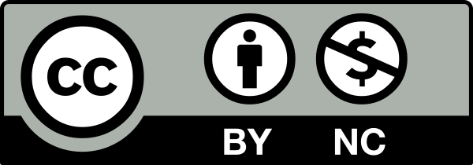

## Licença Creative Commons BY-NC 4.0

### Autor: Luís Simões da Cunha (2025)

Este trabalho está licenciado sob a **Creative Commons Atribuição-NãoComercial 4.0 Internacional (CC BY-NC 4.0)**.

### 📜 Direitos concedidos:
- **Partilha**: És livre para copiar, distribuir e transmitir o material em qualquer meio ou formato.
- **Adaptação**: Podes remixar, transformar e criar a partir deste material.

### ⚠️ Condições:
- **Atribuição**: Deves dar o devido crédito ao autor, fornecer um link para a licença e indicar se foram feitas alterações.
- **Uso Não Comercial**: Não podes utilizar este material para fins comerciais.

🔗 **Mais informações sobre a licença:** [Creative Commons BY-NC 4.0](https://creativecommons.org/licenses/by-nc/4.0/deed.pt)

---

